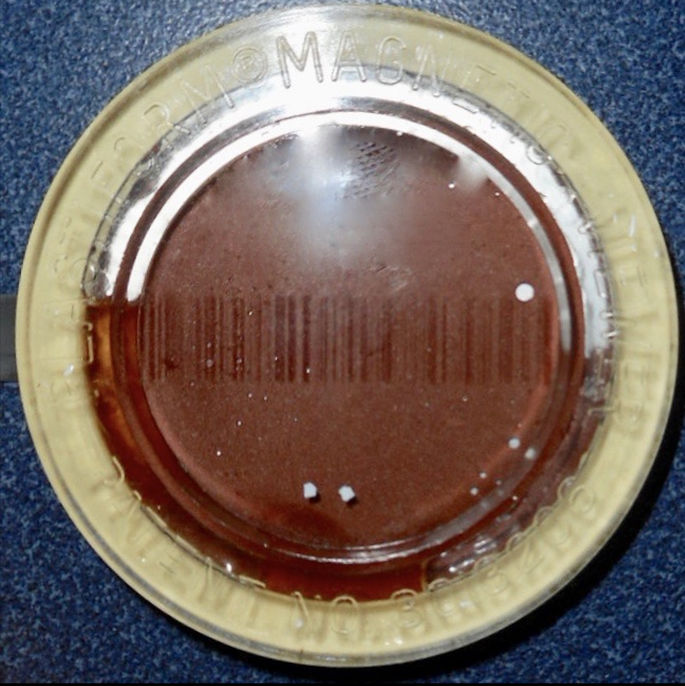
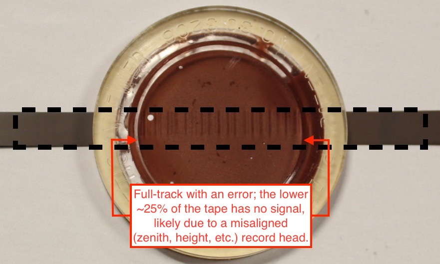
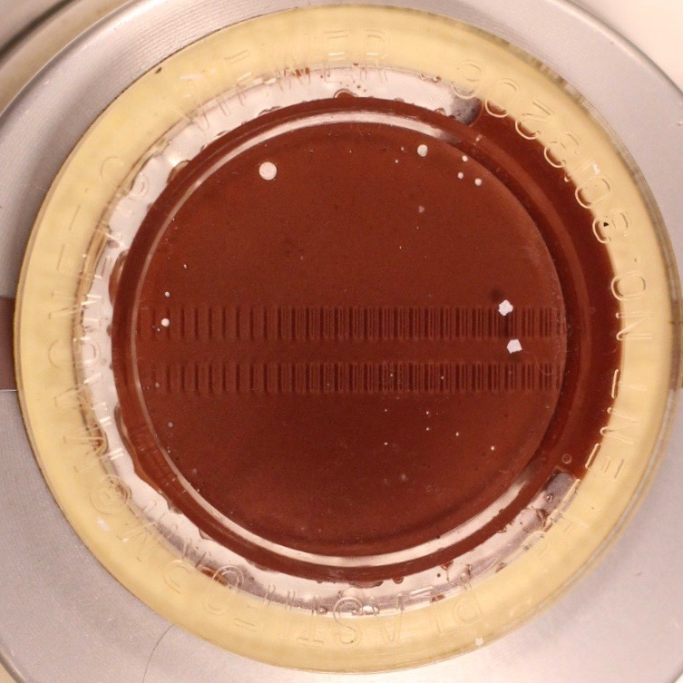
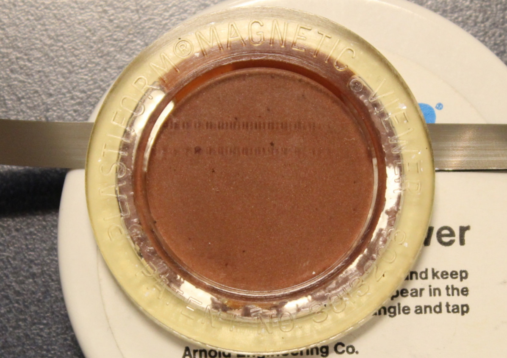
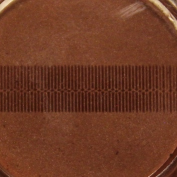
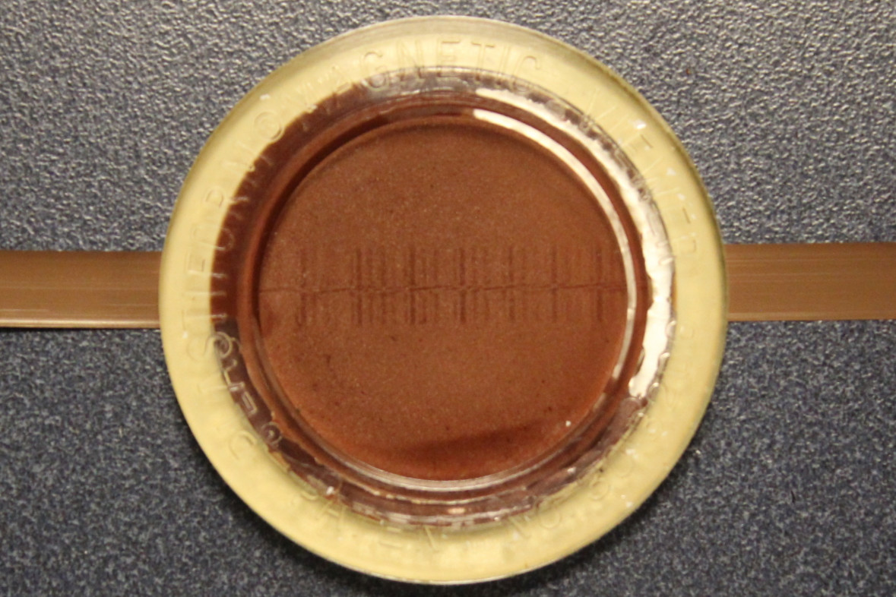
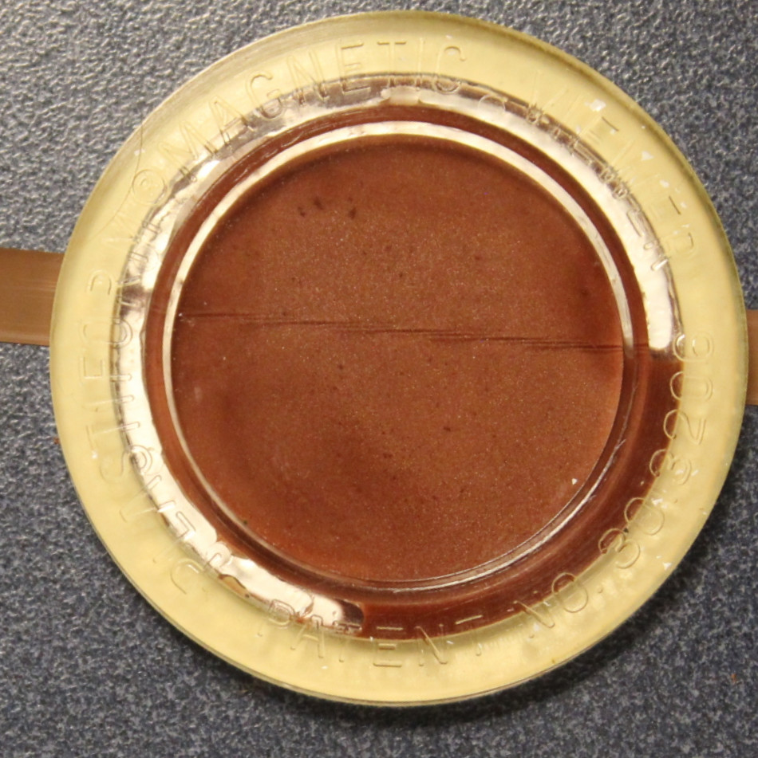
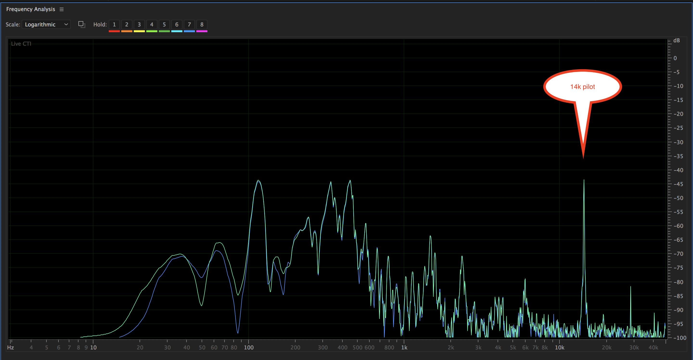

# 1/4-inch tape formatting. 

*Example 1, full-track*.  

*Example 2, full-track likely produced by a record head with alignment error, head clog, etc. 

  
*Example 3, two-track*.  

.  

*Example 4, quarter-track, track 1 and 3 visible*.  

. 

*Example 5, full-track with Nagra pilot*.

.

*Example 6, full-track with Rangertone pilot*.

.

*Example 7, Rangertone pilot with no audio signal*.

.

*Example 8, Fairchild pilot tone: pilot visible at 14k as well as the pilot tone's harmonic distortion at 28k; the principal audio content is below 10k*.

.
